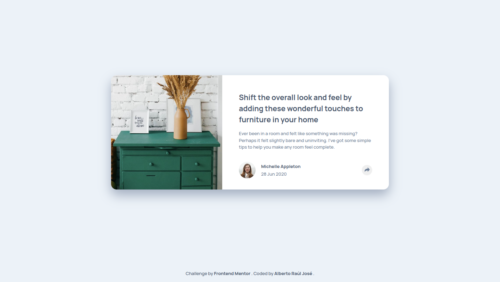
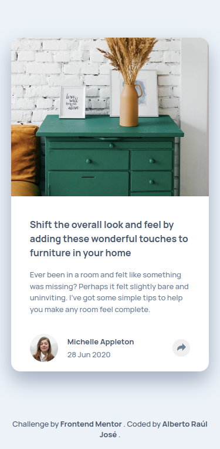
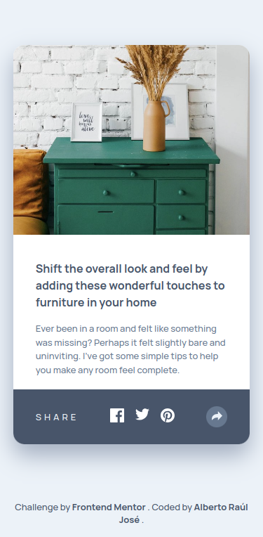
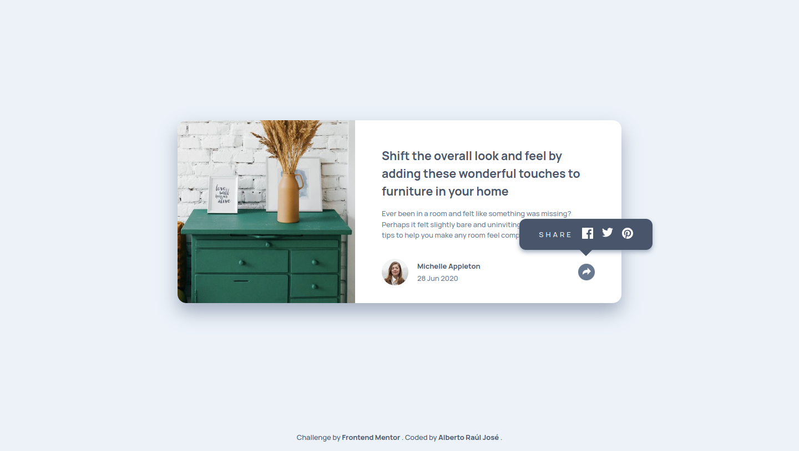

# Frontend Mentor - Article preview component solution

  <strong>Language:</strong> <a href="README.md"> 🇺🇸 English </a> | <a href="README-PT.md"> 🇧🇷 Portuguese </a>

This is a solution to the [Article preview component challenge on Frontend Mentor](https://www.frontendmentor.io/challenges/article-preview-component-dYBN_pYFT). Frontend Mentor challenges help you improve your coding skills by building realistic projects.

## Table of contents

- [Overview](#overview)
  - [Motivations](#motivations)
  - [Screenshot](#screenshot)
  - [Links](#links)
- [My process](#my-process)
  - [Built with](#built-with)
  - [Challenges faced](#challenges-faced)
  - [Continued development](#continued-development)
  - [Useful resources](#useful-resources)
- [Author](#author)
- [Acknowledgments](#acknowledgments)

## Overview

### Motivations

Users should be able to:

- View the optimal layout for the component depending on their device's screen size
- See the social media share links when they click the share icon

### Screenshot

#### Mobile version

  
Collapsed menu

  

  
Expanded menu

  

#### Desktop version

  
Collapsed menu

  

  
Expanded menu

  

### Links

- [Live site](https://alberto-rj.github.io/article-preview-component/)
- [My solution on Frontend Mentor](https://your-solution-url.com)

## My process

### Built with

- Semantic HTML5 markup
- CSS custom properties
- CSS Flexbox
- Mobile-first workflow
- Browser-based JavaScript

### Challenges faced

#### Responsivity

- **Problem:** Adapting the component to different devices (mobile, tablet, desktop) was a challenge.

- **Solution:** CSS Flexbox and CSS Media Queries were used to create a responsive layout. The component was tested on various devices and screen sizes to ensure a good user experience.

#### Accessibility

- **Problem:** The component's low accessibility for visually impaired users was an issue.

- **Solution:** To ensure the component's readability for all users, colors were adjusted based on accessibility tests conducted using tools such as Accessibility Insights and Lighthouse. The alternative colors (#67788f, #ffffff) offer better contrast and make it easier to read for people with low vision.

#### Performance optimization

- **Problem:** Ensuring fast loading times and smooth performance was a major concern, especially with CSS and JavaScript files.

- **Solution:**
  - The CSS was minified.
  - The `defer` attribute was used to load the script.

### Continued development

- **Accessibility:** Make the social media sharing menu accessible for keyboard users.

- **Performance optimization:** Reduce the size of challenge images to improve page load time.

### Useful resources

- [Accessibility Insights for Web](https://accessibilityinsights.io/docs/web/overview/) - A comprehensive tool for performing accessibility testing on websites. It was used to check the component's color contrast.

- [Lighthouse](https://en.wikipedia.org/wiki/Google_Lighthouse) - A tool developed by Google that helps optimize websites, including aspects such as best practices, performance, accessibility, and SEO.

## Author

- GitHub - [Alberto Raúl José](https://github.com/alberto-rj)
- Frontend Mentor - [@alberto-rj](https://www.frontendmentor.io/profile/alberto-rj)
- Twitter - [@albertorauljose](https://www.twitter.com/albertorauljose)

## Acknowledgments

A huge thank you to [Busari Akeem Tunde](https://www.frontendmentor.io/profile/Aalphakeem-Adroit) for their guidance and support throughout the documentation process. Their insights were instrumental in shaping the project's documentation.
